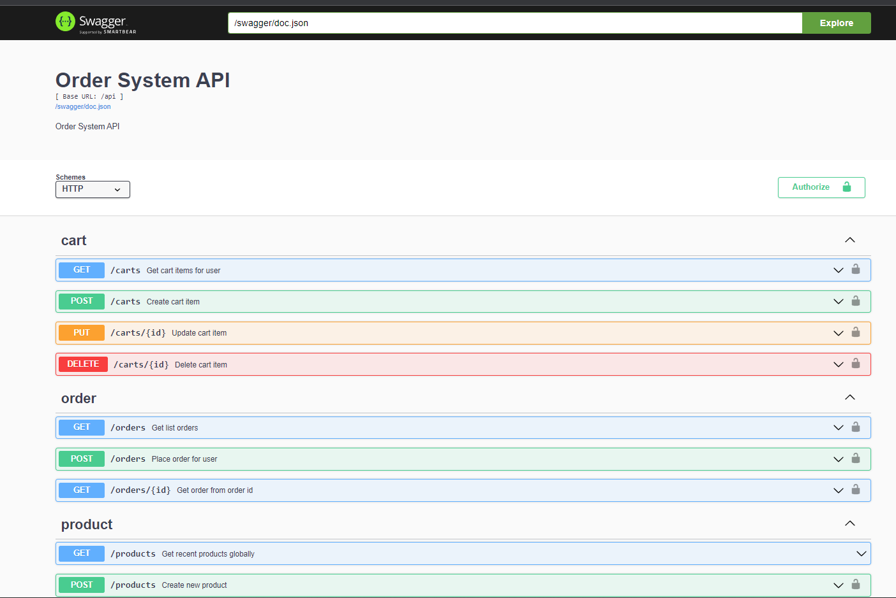

### Clone the repository

Clone this repository:

```bash
➜ git clone https://github.com/nhatquang0672/order-system.git
```

### Install dependencies

```bash
➜ go mod download
```

### Run

```bash
➜ go run main.go
```

### Test
Just run the test individually. Jump into the test file in the handler folder and run each test case.
For now, I can't make the test run parallel because of conflicts when access to the DB file. 

Can't run this command
```bash
➜ go test ./...
```
### Swagger UI

Open url http://localhost:8585/swagger/index.html in a browser.

### Summary Flow

- Signup/Login
- Get product by product id (no authentication)
- Get list products (no authentication)
- Create/update new product (just user role vendor can do)
- 1 user <-> 1 shopping cart
- Create/update/delete item into cart 
- When placing the order, create an order with all items in the shopping cart (each cart item will become an order item). All items in the cart of the user  will be deleted
- Get order by order id
- Get list orders of user

### Don't complete
- Don't update product inventory after placing an order successfully.
- No bonus work.
- Not well-tested and can't run test parallel


